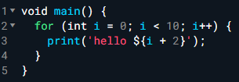
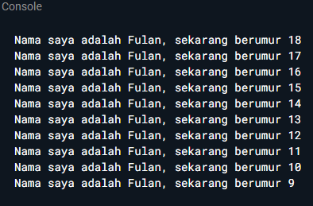
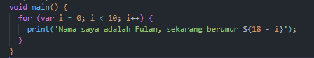
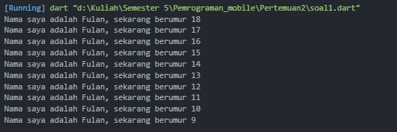

# Tugas Praktikum  
## Soal 1
Modifikasilah kode pada baris 3 di VS Code atau Editor Code favorit Anda berikut ini agar mendapatkan keluaran (output) sesuai yang diminta!

Output yang diminta:

## Soal 2
Mengapa sangat penting untuk memahami bahasa pemrograman Dart sebelum kita menggunakan framework Flutter ? Jelaskan!

## Soal 3
Rangkumlah materi dari codelab ini menjadi poin-poin penting yang dapat Anda gunakan untuk membantu proses pengembangan aplikasi mobile menggunakan framework Flutter.

## Soal 4
Buatlah slide yang berisi penjelasan dan contoh eksekusi kode tentang perbedaan Null Safety dan Late variabel ! (Khusus soal ini kelompok berupa link google slide)

## Jawaban
1. Kode setelah dimodifikasi :  
  
Output kode :  

2. Bahasa dart penting dipahami sebelum menggunakan Flutter karena arsitektur dan logika dari Flutter ditulis dalam bahasa Dart, sehingga memahami bahasa Dart diperlukan untuk memahami dan menggunakan Flutter dengan baik dan efektif seperti mendukung semua aspek dari pengembangan aplikasi Flutter, termasuk manajemen dependensi, kode aplikasi, dan kode plugin.
3. Dart adalah bahasa yang digunakan pada framework Flutter yang didesain untuk memberikan pengalaman pengembangan yang efisien dan produktif.

    <b>Fitur Utama Dart</b>
    - Productive Tooling: Alat bantu pengembangan yang lengkap, termasuk analisis kode dan plugin IDE.
    - Garbage Collection: Mengelola memori secara otomatis dengan menghapus objek yang tidak lagi digunakan.
    - Type Annotations (Opsional): Mendukung pengontrolan tipe data untuk keamanan dan konsistensi.
    - Statically Typed: Menggunakan type inference dan type-safe yang membantu mencegah bug.
    - Portability: Mendukung kompilasi ke JavaScript untuk aplikasi web serta kompilasi native ke ARM dan x86.

    Dart diluncurkan pada 2011 dan versi stabil dirilis pada 2013. Fokus utama awalnya adalah pengembangan web, namun sekarang Dart lebih banyak digunakan dalam pengembangan aplikasi mobile melalui framework Flutter. Dart dirancang untuk memecahkan masalah performa dan skalabilitas yang dihadapi oleh JavaScript.

    <b>Cara Eksekusi Dart</b> 
    Dart VM : Eksekusi kode Dart secara native di lingkungan pengembangan dan runtime.
    JavaScript Compilation: Kompilasi Dart ke JavaScript untuk pengembangan aplikasi web.

    <b>Mode eksekusi:</b> 
    - JIT (Just-In-Time): Kompilasi saat runtime, digunakan selama proses pengembangan.
    - AOT (Ahead-Of-Time): Kompilasi kode sebelum runtime, menghasilkan performa lebih baik.

    <b>Struktur Bahasa Dart</b> 
    - Pemrograman Berorientasi Objek (OOP): Dart menggunakan paradigma OOP dengan konsep encapsulation, inheritance, abstraction, dan polymorphism.
    - Operators: Dart memiliki berbagai operator untuk aritmatika (+, -, *, /, ~/), pembanding (==, !=), serta operator logika (&&, ||, !).

4. Jawaban link terdapat pada LMS