# Tugas Praktikum

# 1. Silakan selesaikan Praktikum 1 sampai 3, lalu dokumentasikan berupa screenshot hasil pekerjaan beserta penjelasannya!
# 2. Buatlah sebuah program yang dapat menampilkan bilangan prima dari angka 0 sampai 201 menggunakan Dart. Ketika bilangan prima ditemukan, maka tampilkan nama lengkap dan NIM Anda.

# Praktikum
## 1.
## Praktikum 1: Menerapkan Control Flows ("if/else")
Selesaikan langkah-langkah praktikum berikut ini menggunakan DartPad di browser Anda.

### Langkah 1: 
Ketik atau salin kode program berikut ke dalam fungsi main(). 
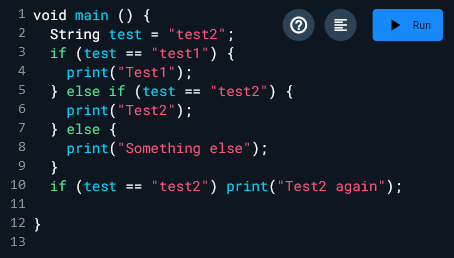 

### Langkah 2: 
Silakan coba eksekusi (Run) kode pada langkah 1 tersebut. Apa yang terjadi? Jelaskan! 
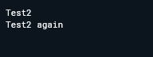 

Program akan menerapkan control flow dengan mengecek nilai dari variabel "test". Program akan error karena syntax tidak benar namun setelah diperbaiki maka karena kondisi terpenuhi pada "else if", program akan menjalankan perintah print dan mencetak "Test2". Setelah itu dilakukan pengecekan dengan if, karena kondisinya terpenuhi maka perintah print akan dijalankan dan mencetak "Test2 again"

## Langkah 3:
Tambahkan kode program berikut, lalu coba eksekusi (Run) kode Anda.! 
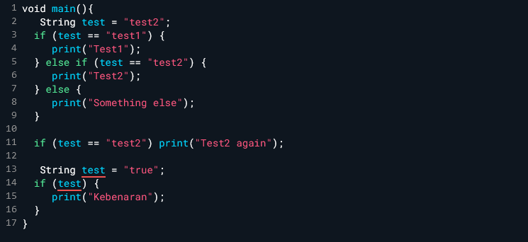 
Apa yang terjadi ? Jika terjadi error, silakan perbaiki namun tetap menggunakan if/else. 
Program akan error. Program setelah diperbaiki: 
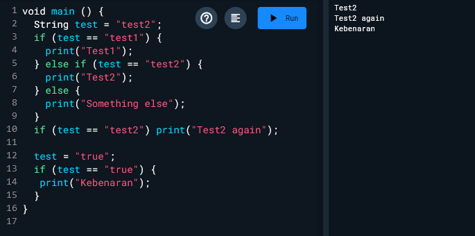 

## Praktikum 2: 
Menerapkan Perulangan "while" dan "do-while" 
Selesaikan langkah-langkah praktikum berikut ini menggunakan DartPad di browser Anda.

### Langkah 1:
Ketik atau salin kode program berikut ke dalam fungsi main(). 
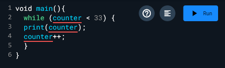 

### Langkah 2:
Silakan coba eksekusi (Run) kode pada langkah 1 tersebut. Apa yang terjadi? Jelaskan! Lalu perbaiki jika terjadi error. 
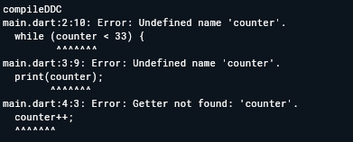 
Program error dikarenakan counter tidak didefinisikan.
Program setelah diperbaiki: 
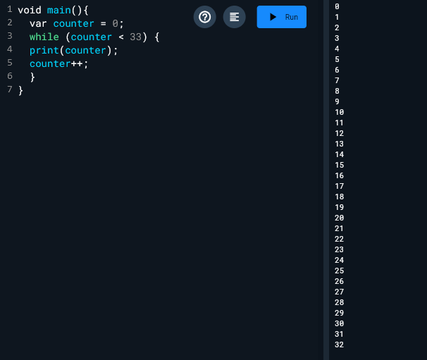 

### Langkah 3:
Tambahkan kode program berikut, lalu coba eksekusi (Run) kode Anda.
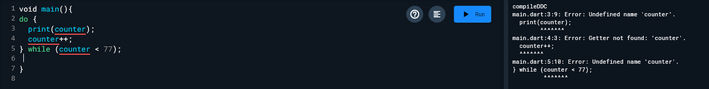 
Apa yang terjadi ? Jika terjadi error, silakan perbaiki namun tetap menggunakan do-while.
Terjadi error karena counter tidak terdefnisi. Program setelah diperbaiki  
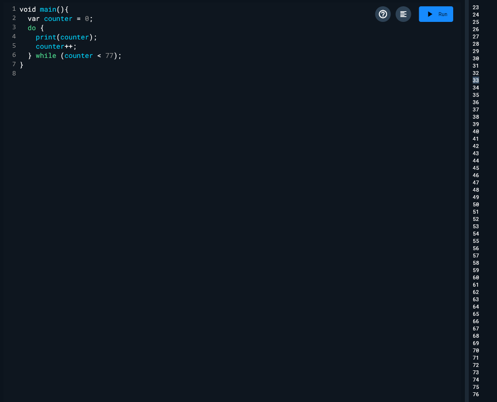 

## Praktikum 3:   
Menerapkan Perulangan "for" dan "break-continue" 
Selesaikan langkah-langkah praktikum berikut ini menggunakan DartPad di browser Anda.

### Langkah 1:
Ketik atau salin kode program berikut ke dalam fungsi main(). 
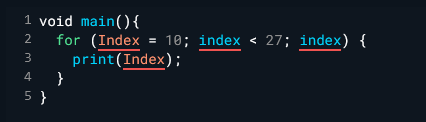 

### Langkah 2:
Silakan coba eksekusi (Run) kode pada langkah 1 tersebut. Apa yang terjadi? Jelaskan! Lalu perbaiki jika terjadi error. 
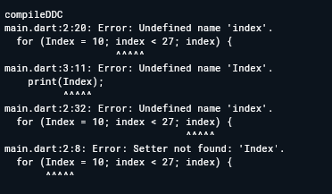 
Terjadi error dikarenakan "index" belum didefinsikan dan terjadi perbedaan penulisan variabel "index". 
Program setelah diperbaiki : 
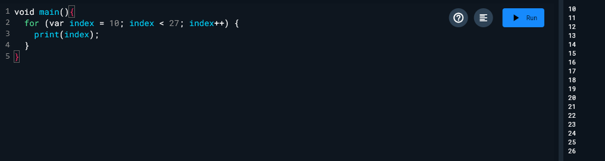 

### Langkah 3:
Tambahkan kode program berikut di dalam for-loop, lalu coba eksekusi (Run) kode Anda. 
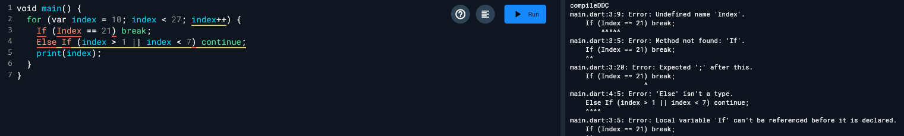 

Apa yang terjadi ? Jika terjadi error, silakan perbaiki namun tetap menggunakan for dan break-continue. 
Terjadi error dikarenakan terjadi kesalahan penulisan syntax dan ketidakkonsistenan nama variabel. Selain itu else if tidak akan dijalankan karena kondisinya tidak terpenuhi. 
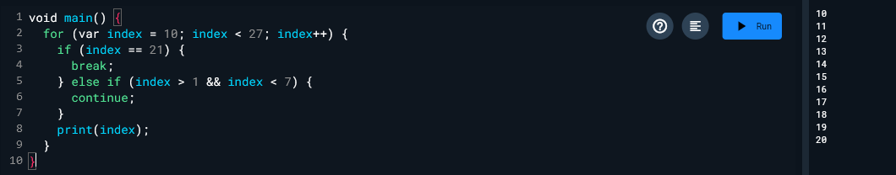 

## 2. Kode Program
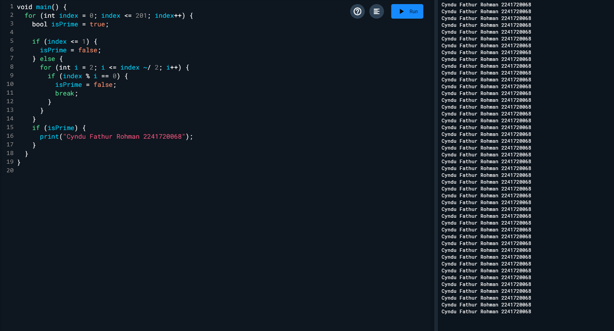 
