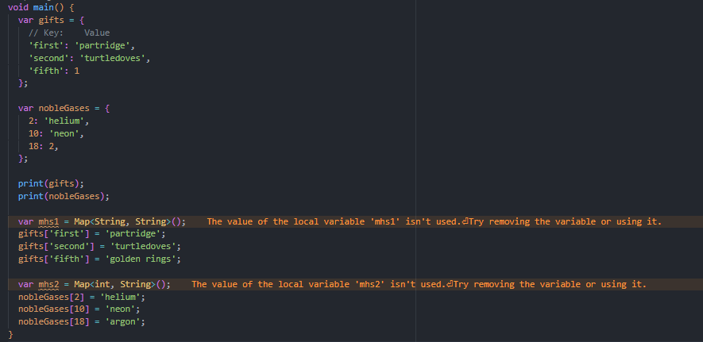
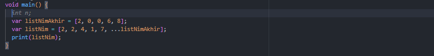
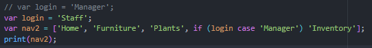
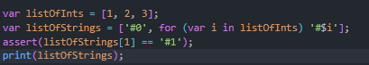

# Laporan Hasil Praktikum
### Nama : Cyndu Fathur Rohman
### NIM : 2241720068
### Kelas : TI-3G  

# Tugas Praktikum
1. Silakan selesaikan Praktikum 1 sampai 5, lalu dokumentasikan berupa screenshot hasil pekerjaan Anda beserta penjelasannya!
2. Jelaskan yang dimaksud Functions dalam bahasa Dart!
3. Jelaskan jenis-jenis parameter di Functions beserta contoh sintaksnya!
4. Jelaskan maksud Functions sebagai first-class objects beserta contoh sintaknya!
5. Apa itu Anonymous Functions? Jelaskan dan berikan contohnya!
6. Jelaskan perbedaan Lexical scope dan Lexical closures! Berikan contohnya!
7. Jelaskan dengan contoh cara membuat return multiple value di Functions!
Kumpulkan berupa link commit repo GitHub pada tautan yang telah disediakan di grup Telegram!#

# Jawab 
## 1. Silakan selesaikan Praktikum 1 sampai 5, lalu dokumentasikan berupa screenshot hasil pekerjaan Anda beserta penjelasannya!
## Praktikum 1
Eksperimen Tipe Data List  

#### Langkah 1:
Ketik atau salin kode program berikut ke dalam void main(). 

 

#### Langkah 2:
Silakan coba eksekusi (Run) kode pada langkah 1 tersebut. Apa yang terjadi? Jelaskan! 
 
- Program akan melakukan pengecekan panjang list dan index ke-1 list.
- Mencetak panjang list dan list index ke-1.
- Mengubah value dari list index ke-1.
- Melakukan pengecekan pada list index ke-1.
- Mencetak list index ke-1.
    
#### Langkah 3:
Ubah kode pada langkah 1 menjadi variabel final yang mempunyai index = 5 dengan default value = null. Isilah nama dan NIM Anda pada elemen index ke-1 dan ke-2. Lalu print dan capture hasilnya. 

- Kode setelah diubah  
 
- Hasil Run : 
 
Apa yang terjadi ? Jika terjadi error, silakan perbaiki. 
- Program akan melakukan pengecekan panjang list dan index ke-1 list.
- Mencetak panjang list dan list index ke-1 (5 dan Cyndu Fathur Rohman).
- Mengubah value dari list index ke-1 menjadi 1.

- Melakukan pengecekan pada list index ke-1.
- Mencetak list index ke-1 dan menampilkan 1.
- Nilai index ke-3 dan ke-4 tidak ditampilkan karena bernilai null.

## Praktikum 2: 
Eksperimen Tipe Data Set

#### Langkah 1:
Ketik atau salin kode program berikut ke dalam fungsi main(). 
 

#### Langkah 2:
Silakan coba eksekusi (Run) kode pada langkah 1 tersebut. Apa yang terjadi? Jelaskan! Lalu perbaiki jika terjadi error. 
 
- Setelah dijalankan maka program akan mencetak semua nilai dalam set.

#### Langkah 3:
Tambahkan kode program berikut, lalu coba eksekusi (Run) kode Anda. 
 
 
- Setelah dijalankan maka program akan mencetak semua nilai dalam set.
- names1, names2, dan names3 bernilai kosong (names1 dan names2 merupakan set sedangkan names3 merupakan map) 

Apa yang terjadi ? Jika terjadi error, silakan perbaiki namun tetap menggunakan ketiga variabel tersebut. Tambahkan elemen nama dan NIM Anda pada kedua variabel Set tersebut dengan dua fungsi berbeda yaitu .add() dan .addAll(). Untuk variabel Map dihapus, nanti kita coba di praktikum selanjutnya. 

- Kode setelah diperbaiki  

 
 
- Nilai yang semula kosong pada set telah diisi dan kemudian dicetak. Pengisian dapat dilakukan satu persatu dengan menggunakan .add atau bersamaan dengan .addAll.

## Praktikum 3: 
Eksperimen Tipe Data Maps

#### Langkah 1:
Ketik atau salin kode program berikut ke dalam fungsi main().  
 

#### Langkah 2:
Silakan coba eksekusi (Run) kode pada langkah 1 tersebut. Apa yang terjadi? Jelaskan! Lalu perbaiki jika terjadi error.  
 
- Program akan mencetak nilai dari setiap elemen pada map beserta key-nya.

#### Langkah 3:
Tambahkan kode program berikut, lalu coba eksekusi (Run) kode Anda.  
 

Apa yang terjadi ? Jika terjadi error, silakan perbaiki.  
 
 
- var mhs1 dan mhs2 tidak dicetak .

Tambahkan elemen nama dan NIM Anda pada tiap variabel di atas (gifts, nobleGases, mhs1, dan mhs2).
- Program setelah diperbaiki 

 
- Hasil run code : 

 

## Praktikum 4: 
Eksperimen Tipe Data List: Spread dan Control-flow Operators

#### Langkah 1:
Ketik atau salin kode program berikut ke dalam fungsi main().  
 

#### Langkah 2:
Silakan coba eksekusi (Run) kode pada langkah 1 tersebut. Apa yang terjadi? Jelaskan! Lalu perbaiki jika terjadi error.  
- Program Error karena list1 tidak didefinisikan 

 
- Kode program setelah diperbaiki : 

 
- Hasil run kode program : 

 

#### Langkah 3:
Tambahkan kode program berikut, lalu coba eksekusi (Run) kode Anda.  
 

Apa yang terjadi ? Jika terjadi error, silakan perbaiki. 
- Program Error karena list1 tidak didefinisikan 

 
- Kode program setelah diperbaiki dengan menambahkan tipe data: 

 
- Hasil run kode program : 

 

Tambahkan variabel list berisi NIM Anda menggunakan Spread Operators. Dokumentasikan   hasilnya dan buat laporannya!  
- Kode program : 

 
- Hasil run kode program : 

 

#### Langkah 4:
Tambahkan kode program berikut, lalu coba eksekusi (Run) kode Anda. 
 
Apa yang terjadi ? Jika terjadi error, silakan perbaiki. Tunjukkan hasilnya jika variabel promoActive ketika true dan false. 
 
Terjadi error dikarenakan variabel promoActive belum didefinisikan. 
- Hasil Perbaikan dengan Menginisialisasi variabel promoActive bernilai true 

 
 
- Hasil Perbaikan dengan Menginisialisasi variabel promoActive bernilai false. 

 
 

#### Langkah 5:
Tambahkan kode program berikut, lalu coba eksekusi (Run) kode Anda.
 
Apa yang terjadi ? Jika terjadi error, silakan perbaiki. Tunjukkan hasilnya jika variabel login mempunyai kondisi lain. 

Pada program tersebut dilakukan pengecekan parameter apakah "case" bernilai "Manager". Pada program ini terjadi error karena variabel case belum diinisialisasi  
- Hasil Perbaikan dengan Menginisialisasi variabel case 

 
- Hasil Perbaikan dengan Menginisialisasi variabel case dengan kondisi lain 

 
 

#### Langkah 6:
Tambahkan kode program berikut, lalu coba eksekusi (Run) kode Anda. 
 

Apa yang terjadi ? Jika terjadi error, silakan perbaiki. Jelaskan manfaat Collection For dan dokumentasikan hasilnya. 
 
- Dilakukan pengecekan apakan index ke-1 dari variabel lilstOfStrings bernilai "1" dan kemudian program akan mencetak "0" dan kemudian melakukan perulangan untuk mencetak setiap nilai dari variabel pada listOfInts. 

## Praktikum 5: Eksperimen Tipe Data Records

### Langkah 1:
Ketik atau salin kode program berikut ke dalam fungsi main(). 
 

### Langkah 2:
Silakan coba eksekusi (Run) kode pada langkah 1 tersebut. Apa yang terjadi? Jelaskan! Lalu perbaiki jika terjadi error. 
 
Program akan mencetak seluruh nilai yang berada pada record baik itu berupa nilai dari elemen maupun nama field beserta nilainya 

### Langkah 3:
Tambahkan kode program berikut di luar scope void main(), lalu coba eksekusi (Run) kode Anda. 
 
Apa yang terjadi ? Jika terjadi error, silakan perbaiki. Gunakan fungsi tukar() di dalam main() sehingga tampak jelas proses pertukaran value field di dalam Records. 
 

Program mengalami error karena parameter yang dapat dimasukkan adalah (int, int).
- Program setelah diperbaiki : 

 
 

### Langkah 4:
Tambahkan kode program berikut di dalam scope void main(), lalu coba eksekusi (Run) kode Anda. 
 
Apa yang terjadi ? Jika terjadi error, silakan perbaiki. Inisialisasi field nama dan NIM Anda pada variabel record mahasiswa di atas. Dokumentasikan hasilnya dan buat laporannya! 
 
Terjadi error pada program dikarenakan variabel mahasiswa tidak diinisialisasi.
- Kode program setelah diperbaiki dengan menambahkan String nama dan int NIM mahasiswa

 
 

### Langkah 5:
Tambahkan kode program berikut di dalam scope void main(), lalu coba eksekusi (Run) kode Anda. 
 

Apa yang terjadi ? Jika terjadi error, silakan perbaiki. Gantilah salah satu isi record dengan nama dan NIM Anda 
 

Program akan mencetak nilai dari variabel mahasiswa2 dimana pada pencetakan dapat dilakukan dengan menggunakan urutan index atau nama dari field 

- Kode program setelah lakukan pergantian record menjadi nama dan NIM mahasiswa. 

 
 

## 2. Jelaskan yang dimaksud Functions dalam bahasa Dart.
Function adalah sekumpulan pernyataan yang menerima input, melakukan komputasi tertentu, dan menghasilkan output.

contoh :

    // Function
    int tambah(int a, int b) {
        return a + b;
    }

    void main() {
        int hasil = tambah(2, 3);
        print('Hasil : $hasil'); 
    }

Program akan memanggil function dan melakukan penjumlahan dari dua variabel integer yang telah diinputkan dan kemudian akan mengembalikan output berupa integer hasil dari penjumlahan kedua variabel tersebut.

## 3. Jelaskan jenis-jenis parameter di Functions beserta contoh sintaksnya!
- #### 1. Positional Parameters
Positional parameters adalah parameter yang urutannya sangat penting ketika memanggil function. Nilai yang diberikan saat memanggil function harus sesuai dengan urutan parameter yang dideklarasikan.  

    void positionalExample(int param1, String param2) {
        print("param1 is $param1");
        print("param2 is $param2");
    }

    void main() {
        positionalExample(10, 'Dart');
    }

- #### 2. Optional Positional Parameters
Optional Positional Parameters menggunakan tanda kurung siku [] untuk menandakan bahwa parameter tersebut opsional. Jika tidak diberikan saat memanggil function, parameter tersebut akan bernilai null kecuali ditetapkan nilai default. 

    void optionalPositional(int param1, [var param2]) {
        print("param1 is $param1");
        print("param2 is $param2");
    }

    void main() {
        optionalPositional(5); 
    }

Jika tidak ada nilai untuk param2, nilainya secara otomatis akan menjadi null.

- #### 3. Optional Named Parameters
Optional Named Parameters menggunakan kurung kurawal {} untuk menandakan parameter yang bersifat opsional dan diberi nama secara eksplisit. Jika parameter opsional tidak diberikan, nilainya juga akan menjadi null kecuali diberi nilai default.

    void optionalNamed(int param1, {var param2, var param3}) {
        print("param1 is $param1");
        print("param2 is $param2");
        print("param3 is $param3");
    }

    void main() {
        optionalNamed(1, param3: 'Hello'); // Memberikan nilai untuk param1 dan param3
    }

Pada contoh ini, hanya param3 yang diberikan. param2 tidak diberikan sehingga nilainya null.

- #### 4. Default Parameters
Default Parameters adalah parameter opsional yang diberi nilai default. Jika parameter tersebut tidak diberikan nilai saat function dipanggil, maka nilai default yang akan digunakan.

    void defaultValue(int param1, {int param2 = 12}) {
        print("param1 is $param1");
        print("param2 is $param2");
    }

    void main() {
        defaultValue(1); // Hanya memberikan nilai untuk param1
    }
Karena param2 tidak diberikan, maka nilai default 12 yang digunakan. Jika kamu memberikan nilai untuk param2, nilai tersebut akan menggantikan nilai default.

## 4. Jelaskan maksud Functions sebagai first-class objects beserta contoh sintaknya!

Functions sebagai first-class objects dapat digunakan untuk meneruskan function sebagai parameter ke function lain.

    void printElement(int element) {
    print(element);
    }

    void main() {
    var list = [1, 2, 3];

    list.forEach(printElement); 
    }

## 5. Apa itu Anonymous Functions? Jelaskan dan berikan contohnya!
Anonymous Functions adalah function yang tidak memiliki nama. Anonymous Functions digunakan ketika meneruskan function sebagai parameter atau menggunakan function sementara tanpa harus mendeklarasikan function dengan nama.

    void main() {
    var numbers = [1, 2, 3, 4, 5];
    
    numbers.forEach((number) {
        print(number * 2);
    });
    }
## 6. Jelaskan perbedaan Lexical scope dan Lexical closures! Berikan contohnya!
#### Lexical Scope
Lexical scope adalah function yang menentukan lingkup variabel berdasarkan letak kode tempat variabel tersebut didefinisikan. Pada Lexical scope variabel-variabel dapat diakses dalam lingkup di mana mereka dideklarasikan dan semua lingkup di dalamnya.

    bool topLevel = true;

    void main() {
    var insideMain = true;

    void myFunction() {
        var insideFunction = true;

        void nestedFunction() {
        var insideNestedFunction = true;

        assert(topLevel);             
        assert(insideMain);         
        assert(insideFunction);     
        assert(insideNestedFunction); 
        }

        nestedFunction(); /
    }

    myFunction(); 
    }

#### Lexical Closures
Closure adalah konsep di mana sebuah fungsi "menutup" variabel yang didefinisikan di lingkup di sekelilingnya. Dengan kata lain, sebuah fungsi dapat mengakses variabel yang dideklarasikan di luar fungsinya sendiri meskipun fungsi tersebut dipanggil di luar lingkup asalnya.

    Function makeAdder(int addBy) {
    return (int i) => addBy + i;
    }

    void main() {
    var add2 = makeAdder(2);

    var add4 = makeAdder(4);

    assert(add2(3) == 5); 
    assert(add4(3) == 7);
    }

## 7. Jelaskan dengan contoh cara membuat return multiple value di Functions!
Pada Dart untuk membuat return multi value dapat digunakan tuple, list atau maps. namun pada percobaan ini akan dilakukan contoh dengan menggunakan maps.

    Map<String, dynamic> getProfile() {
    return {
        'nim': 2241720068,
        'nama': 'Fathur'
    };
    }

    void main() {
    var profile = getProfile();
    print("NIM: ${profile['nim']}");  
    print("Nama: ${profile['nama']}");
    }