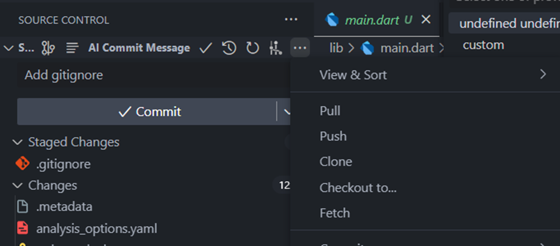
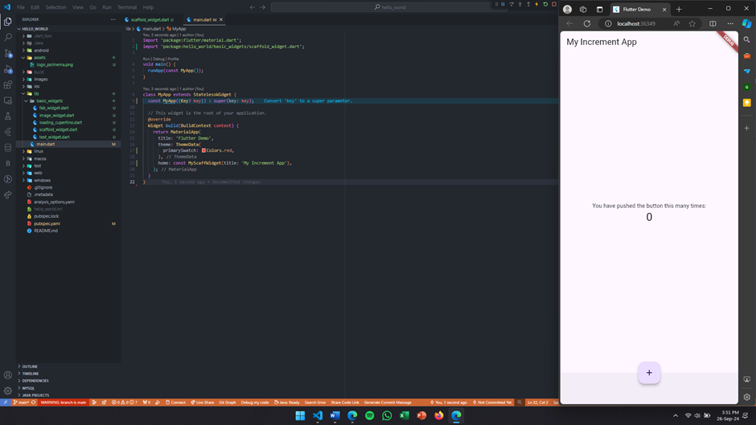

# LAPORAN PRAKTIKUM PREMOGRAMAN MOBILE
## Aplikasi Pertama dan Widget Dasar Flutter

#### Nama : Cyndu Fathur Rohman 
#### Kelas : TI-3G 
#### No Absen : 10 

Link repository praktikum
1. https://github.com/CFathurrohman/flutter-fundamental-part1  
2. https://github.com/CFathurrohman/namer_app  

### Praktikum 1 Membuat Project Flutter Baru
#### Langkah 1: 
Buka VS Code, lalu tekan tombol Ctrl + Shift + P maka akan tampil Command Palette, lalu ketik Flutter. Pilih New Application Project.

#### Langkah 2: 
Kemudian buat folder sesuai style laporan praktikum yang Anda pilih. Disarankan pada folder dokumen atau desktop atau alamat folder lain yang tidak terlalu dalam atau panjang. Lalu pilih Select a folder to create the project in. 

#### Langkah 3:
Buat nama project flutter hello_world seperti berikut, lalu tekan Enter. Tunggu hingga proses pembuatan project baru selesai. 

#### Langkah 4:
Jika sudah selesai proses pembuatan project baru, pastikan tampilan seperti berikut. Pesan akan tampil berupa "Your Flutter Project is ready!" artinya Anda telah berhasil membuat project Flutter baru. 

### Praktikum 2 Menghubungkan Perangkat Android atau Emulator

#### Langkah 1: 
Mengaktifkan proses debug USB
Agar Android Studio dapat berkomunikasi dengan perangkat Android, Opsi Developer Option harus diaktifkan : 

#### Langkah 2:
Menginstal Driver USB Google (khusus Windows)
Jika Android Studio diinstal di Windows, Anda harus menginstal driver perangkat USB agar dapat menjalankan aplikasi di perangkat fisik.
Di Android Studio, klik Tools > SDK Manager. Dialog Preferences > Appearance & Behavior > System Settings > Android SDK akan terbuka.
Klik tab SDK Tools. 
 
Pilih Google USB Driver, lalu klik OK. 

#### Langkah 3:
Menjalankan aplikasi di perangkat Android menggunakan kabel
Sambungkan perangkat Android ke komputer menggunakan kabel USB. Dialog yang meminta Anda mengizinkan proses debug USB akan muncul di perangkat. 

Pilih kotak centang Always allow from this computer, lalu ketuk OK. 

Pilih perangkat lalu klik OK. Android Studio akan menginstal aplikasi di perangkat, lalu menjalankannya. 

### Praktikum 3 Membuat Repository GitHub dan Laporan Praktikum
#### Langkah 1:
Login ke akun GitHub Anda, lalu buat repository baru dengan nama "flutter-fundamental-part1" 

#### Langkah 2:
Lalu klik tombol "Create repository" lalu akan tampil seperti gambar berikut. 

#### Langkah 3:
Kembali ke VS code, project flutter hello_world, buka terminal pada menu Terminal > New Terminal. Lalu ketik perintah berikut untuk inisialisasi git pada project Anda. 

git init
#### Langkah 4:
Pilih menu Source Control di bagian kiri, lalu lakukan stages (+) pada file .gitignore untuk mengunggah file pertama ke repository GitHub. 

#### Langkah 5:
Beri pesan commit "tambah gitignore" lalu klik Commit (✔) 

#### Langkah 6:
Lakukan push dengan klik bagian menu titik tiga > Push 

#### Langkah 7:
Di pojok kanan bawah akan tampil seperti gambar berikut. Klik "Add Remote" 
#### Langkah 8:
Salin tautan repository Anda dari browser ke bagian ini, lalu klik Add remote 

Setelah berhasil, tulis remote name dengan "origin" 

#### Langkah 9:
Lakukan push juga untuk semua file lainnya dengan pilih Stage All Changes. Beri pesan commit "project hello_world". Maka akan tampil di repository GitHub Anda seperti berikut. 

#### Langkah 11:
Ubah platform di pojok kanan bawah ke emulator atau device atau bisa juga menggunakan browser Chrome. Lalu coba running project hello_world dengan tekan F5 atau Run > Start Debugging. Tunggu proses kompilasi hingga selesai, maka aplikasi flutter pertama Anda akan tampil seperti berikut. 

#### Langkah 12:
Screenshot seperti pada Langkah 11, namun teks yang ditampilkan dalam aplikasi berupa nama lengkap. Simpan file screenshot dengan nama 01.png pada folder images (buat folder baru jika belum ada) di project hello_world.  

Lalu ubah isi README.md seperti berikut, sehingga tampil hasil screenshot pada file README.md. 

### Praktikum 4: Menerapkan Widget Dasar

#### Langkah 1: Text Widget
Buat folder baru basic_widgets di dalam folder lib. Kemudian buat file baru di dalam basic_widgets dengan nama text_widget.dart. 

Lakukan import file text_widget.dart ke main.dart, lalu ganti bagian text widget dengan kode di atas. 

#### Langkah 2: Image Widget
Buat sebuah file image_widget.dart di dalam folder basic_widgets dengan isi kode berikut. 

Lakukan penyesuaian asset pada file pubspec.yaml dan tambahkan file logo Anda di folder assets project hello_world. 

Jangan lupa sesuaikan kode dan import di file main.dart kemudian akan tampil gambar seperti berikut. 

### Praktikum 5: Menerapkan Widget Material Design dan iOS Cupertino
#### Langkah 1: Cupertino Button dan Loading Bar
Buat file di basic_widgets > loading_cupertino.dart. Import stateless widget dari material dan cupertino. Lalu isi kode di dalam method Widget build sebagai berikut. 

#### Langkah 2: Floating Action Button (FAB)
Button widget terdapat beberapa macam pada flutter yaitu ButtonBar, DropdownButton, TextButton, FloatingActionButton, IconButton, OutlineButton, PopupMenuButton, dan ElevatedButton. 
Buat file di basic_widgets > fab_widget.dart. Import stateless widget dari material. Lalu isi kode di dalam method Widget build sebagai berikut. 

#### Langkah 3: Scaffold Widget
Scaffold widget digunakan untuk mengatur tata letak sesuai dengan material design. 
Ubah isi kode main.dart seperti berikut. 

#### Langkah 4: Dialog Widget
Dialog widget pada flutter memiliki dua jenis dialog yaitu AlertDialog dan SimpleDialog. 
Ubah isi kode main.dart seperti berikut. 

#### Langkah 5: Input dan Selection Widget

#### Langkah 6: Date and Time Pickers
Date and Time Pickers termasuk pada kategori input dan selection widget, berikut adalah contoh penggunaan Date and Time Pickers.  

## Selesaikan "Codelabs: Your first Flutter app": https://codelabs.developers.google.com/codelabs/flutter-codelab-first#0

### Membuat project
Membuat proyek Flutter pertama Anda 
Luncurkan Visual Studio Code dan buka palet perintah (dengan F1 atau Ctrl+Shift+P atau Shift+Cmd+P). Ketik "flutter new". Pilih perintah Flutter: New Project. 

Berikutnya, pilih Application lalu folder tempat proyek akan dibuat. 

Terakhir, beri nama proyek Anda. Beri nama seperti namer_app atau my_awesome_namer. 

Flutter kini membuat folder proyek Anda dan VS Code membuka folder tersebut. 

Menyalin & Menempelkan aplikasi awal 
Pada panel sebelah kiri VS Code, pastikan bahwa Penjelajah dipilih lalu buka file pubspec.yaml. 

Ganti konten file pubspec.yaml ini dengan kode berikut: 

File pubspec.yaml menentukan informasi dasar tentang aplikasi Anda, seperti versi aplikasi saat ini, dependensi aplikasi, dan aset yang digunakan oleh aplikasi untuk pengiriman. 

Berikutnya, buka file konfigurasi lainnya dalam proyek tersebut, analysis_options.yaml. 

Ganti konten file tersebut dengan kode berikut: 
analysis_options.yaml 

File ini menentukan seberapa ketat Flutter saat menganalisis kode Anda. Karena percobaan ini adalah percobaan pertama Anda menggunakan Flutter, Anda memberi tahu penganalisis agar tidak terlalu ketat. Anda dapat mengatur ini kapan saja. Bahkan, seiring mendekati pemublikasian aplikasi produksi sebenarnya, Anda kemungkinan besar akan ingin membuat penganalisis lebih ketat dari ini. 

Terakhir, buka file main.dart pada direktori lib/. 

Ganti konten file ini dengan kode berikut: 

lib/main.dart 

### Menambahkan tombol
Langkah ini menambahkan tombol Next untuk menghasilkan pasangan kata baru. 

Meluncurkan aplikasi 
Pertama, buka lib/main.dart dan pastikan Anda memilih perangkat target. Di bagian pojok kanan bawah VS Code, Anda akan menemukan tombol yang menampilkan perangkat target saat ini. Klik tombol untuk mengubahnya. 

Selagi lib/main.dart terbuka, temukan tombol "play" Di pojok kanan atas jendela VS Code lalu klik tombol tersebut. 

Setelah beberapa saat, aplikasi Anda diluncurkan dalam mode debug. Tampilannya masih terlihat biasa saja: 

Hot Reload Pertama 
Di bagian bawah lib/main.dart, tambahkan sesuatu pada string di objek Text pertama, dan simpan file tersebut (dengan Ctrl+S atau Cmd+S). Misalnya:

        return Scaffold(
        body: Column(
            children: [
            Text('A random AWESOME idea:'),  // ← Example change.
            Text(appState.current.asLowerCase),
            ],
        ),
        );

lib/main.dart 

Berikutnya, tambahkan tombol di bagian bawah Column, tepat di bawah instance Text kedua. 

lib/main.dart 

Di bagian paling atas file tersebut, dapat ditemukan fungsi main(). Dalam wujudnya saat ini, fungsi ini hanya memberi tahu Flutter untuk menjalankan aplikasi yang ditentukan pada MyApp. 
lib/main.dart 

Class MyApp memperluas StatelessWidget. Widget adalah elemen tempat Anda membangun setiap aplikasi Flutter. Bahkan aplikasi itu sendiri adalah widget. 

Metode getNext() baru menetapkan ulang current dengan WordPair acak baru. Metode ini juga memanggil notifyListeners()(metode ChangeNotifier) yang memastikan bahwa semua orang yang melihat MyAppState diberi tahu. 

Terakhir adalah memanggil metode getNext dari callback tombol tersebut. 

lib/main.dart

Aplikasi akan menghasilkan pasangan kata acak baru setiap kali menekan tombol Next. 

### Memperindah tampilan aplikasi
Tulis ulang widget MyHomePage sebagai berikut: 
lib/main.dart 

Pada menu Refactor, pilih Extract Widget. Tetapkan nama, seperti BigCard, lalu klik Enter. 

lib/main.dart 
       
#### Menambahkan Kartu
Pilih Wrap with Padding. Tindakan ini menciptakan widget induk baru di sekitar widget Text bernama Padding. Setelah menyimpannya, Anda akan melihat bahwa kata acak tersebut telah memiliki ruang yang lebih luas. 
Tingkatkan padding dari nilai default 8.0. Misalnya, gunakan 20 untuk padding yang lebih luas. 

Tempatkan kursor Anda pada widget Padding, buka menu Refactor, lalu pilih Wrap with widget 

Tindakan ini memungkinkan Anda untuk menentukan widget induk. Ketik "Card" dan tekan Enter. 

#### Tema dan gaya
Untuk membuat kartu menjadi lebih menarik, beri warna yang lebih kaya pada kartu tersebut. Karena ada baiknya untuk menjaga skema warna yang konsisten, gunakan Theme aplikasi untuk memilih warna. 

Buat perubahan berikut untuk metode build() BigCard. 

#### TextTheme
Kartu tersebut masih memiliki masalah: ukuran teks terlalu kecil dan warnanya membuat teks sulit dibaca. Untuk memperbaiki masalah ini, buat perubahan berikut pada metode build() BigCard. 

lib/main.dart

Gunakan properti semanticsLabel Text untuk mengganti konten visual widget teks dengan konten semantik yang lebih sesuai untuk pembaca layar: 
#### Meningkatkan aksesibilitas
Mengganti pair.asLowerCase dengan "${pair.first} ${pair.second}" : 

#### Menempatkan UI di tengah
Setelah pasangan kata acak dihadirkan dengan gaya visual yang cukup, saatnya menempatkan UI di tengah jendela/layar aplikasi.  

Buka metode build() MyHomePage, dan buat perubahan berikut: 

lib/main.dart 

Tindakan ini menempatkan turunan dalam Column di tengah pada sumbu utamanya (vertikal). 

Menempatkan kolom itu sendiri di tengah. Letakkan kursor Anda di Column, buka menu Refactor (dengan Ctrl+. atau Cmd+.), lalu pilih Wrap with Center. 

### Menambahkan fungsi
#### Menambahkan logika bisnis
Scroll ke MyAppState dan tambahkan kode berikut: 

lib/main.dart 

Tambahkan properti baru pada MyAppState yang bernama favorites. Properti ini diinisialisasi dengan daftar kosong: []. 

#### Menambahkan tombol
Pertama, gabungkan tombol yang ada pada Row. Buka metode build() MyHomePage, letakkan kursor pada ElevatedButton, buka menu Refactor dengan Ctrl+. atau Cmd+., lalu pilih Wrap with Row.Berikutnya, tambahkan tombol Like dan hubungkan ke toggleFavorite(). 

lib/main.dart

### Menambahkan kolom samping navigasi
Pilih keseluruhan MyHomePage, hapus, dan gantikan dengan kode berikut: 

lib/main.dart 

Saat disimpan, Anda akan melihat sisi visual UI telah siap—tetapi tidak bekerja. Mengklik ♥︎ (hati) pada kolom samping navigasi tidak melakukan apa pun. 

#### Widget stateless versus stateful
Tempatkan kursor Anda di baris pertama MyHomePage (baris yang diawali dengan class MyHomePage...), lalu buka menu Refactor menggunakan Ctrl+. atau Cmd+.. Kemudian, pilih Convert to StatefulWidget. 

#### setState
Widget stateful baru hanya perlu melacak satu variabel: selectedIndex. Buat 3 perubahan berikut untuk _MyHomePageState: 

lib/main.dart

Diperkenalkan variabel baru, selectedIndex, dan melakukan inisialisasi menjadi 0. 

#### Menggunakan selectedIndex
Tempatkan kode berikut di bagian atas metode build _MyHomePageState, tepat sebelum return Scaffold: 

lib/main.dart

Kode tersebut mendeklarasikan variabel baru, page, dari jenis Widget. 
Kemudian, pernyataan switch menetapkan layar untuk page, berdasarkan nilai saat ini pada selectedIndex. 

lib/main.dart 

Aplikasi sekarang beralih di antara GeneratorPage kita dan placeholder yang akan segera menjadi halaman Favorites. 

#### Tingkat respons
Berikutnya, buat kolom samping navigasi menjadi responsif. Dengan kata lain, buat agar kolom samping navigasi menampilkan label secara otomatis (menggunakan extended: true) saat ada ruang yang cukup. 

Dalam metode build _MyHomePageState, letakkan kursor Anda pada Scaffold. 
Buka menu Refactor dengan Ctrl+. (Windows/Linux) atau Cmd+. (Mac). 
Pilih Wrap with Builder dan tekan Enter. 
Modifikasi nama Builder yang baru ditambahkan menjadi LayoutBuilder. 
Modifikasi daftar parameter callback dari (context) menjadi (context, constraints). 

lib/main.dart 

### Menambahkan halaman baru
class FavoritesPage baru: 

lib/main.dart 

Fungsi widget tersebut: 
Widget ini mendapatkan status aplikasi saat ini. 
Jika daftar favorit kosong, pesan terpusat berikut akan ditampilkan: No favorites yet*.* 
Jika tidak, daftar (dapat di-scroll) akan ditampilkan. 
Daftar tersebut dimulai dengan ringkasan (misalnya, You have 5 favorites*.*). 
Kode tersebut kemudian melakukan iterasi di seluruh favorit dan membuat widget ListTile untuk masing-masing favorit. 